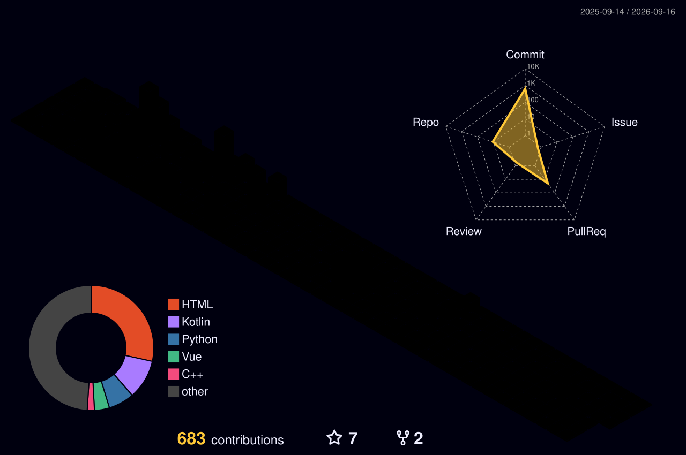

<h1 align="center">👋 WELCOME TO MY PAGE 👋</h1>

  <b>Hi, I'm Tuan👋</b> 
  

  

## 🛠 Languages and Tools

<table>
  <tr>
    <td align='center' width="160">
        
         Python
    </td>
    <td align='center' width="160">
        
         C++
    </td>
    <td align='center' width="160">
        
         SQL
    </td>
    <td align='center' width="160">
        
         Firebase
    </td>
    <td align='center' width="160">
        
         Pandas
    </td>
  </tr>
  <tr>
    <td align='center' width="160">
        
         NumPy
    </td>
    <td align='center' width="160">
        
         Matplotlib
    </td>
    <td align='center' width="160">
        
         Power BI
    </td>
    <td align='center' width="160">
        
         Excel
    </td>
    <td align='center' width="160">
        
         Git
    </td>
  </tr>
</table>

## 📫 How to reach me

## 📊 GitHub Stats

## 🚀 Projects 
 

 

 

## 🏢 3D Contribution Map

  

## 📈 Activity Graph

  

## 🕒 Productive Time

  
  

## 🐍 GitHub Activity

  

